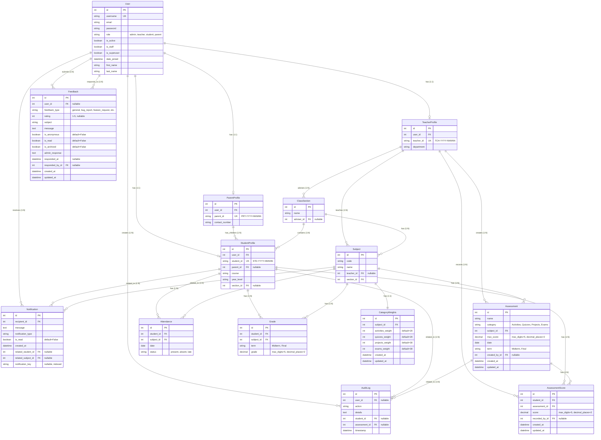

# Entity Relationship Diagram (ERD)
## ADS-EduLog System

This document contains the Entity Relationship Diagram for the ADS-EduLog educational management system.

## Entity Descriptions

### Core User Management
- **User**: Central authentication and authorization entity. Supports multiple roles (admin, teacher, student, parent).
- **ParentProfile**: Extended profile for parents with contact information.
- **TeacherProfile**: Extended profile for teachers with department information.
- **StudentProfile**: Extended profile for students with academic information (course, year level, section).

### Academic Structure
- **ClassSection**: Represents class sections with an assigned adviser (teacher).
- **Subject**: Course subjects taught by teachers to specific sections.

### Academic Records
- **Attendance**: Daily attendance records for students per subject.
- **Grade**: Term-based grades (Midterm/Final) for students per subject.
- **Assessment**: Assessment items (Activities, Quizzes, Projects, Exams) created by teachers.
- **AssessmentScore**: Individual student scores for each assessment.
- **CategoryWeights**: Weight distribution for assessment categories per subject (must sum to 100%).

### System Features
- **Notification**: System notifications sent to users, with support for deduplication via notification_key.
- **AuditLog**: Audit trail tracking all changes to grades and assessments.
- **Feedback**: User feedback system with support for anonymous submissions and admin responses.

## Key Constraints

1. **Unique Constraints:**
   - One attendance record per student per subject per day
   - One grade per student per subject per term
   - One assessment score per student per assessment
   - One category weight configuration per subject

2. **Business Rules:**
   - Category weights must sum to 100%
   - User can only have one profile type (ParentProfile, TeacherProfile, or StudentProfile)
   - Custom ID generation: PRT-YYYY-NNNNN, TCH-YYYY-NNNNN, STD-YYYY-NNNNN

3. **Cascade Behaviors:**
   - User deletion cascades to profiles
   - Student deletion cascades to attendance, grades, and assessment scores
   - Subject deletion cascades to assessments, attendance, and grades
   - Assessment deletion cascades to assessment scores

## Relationship Cardinalities

- **1:1 Relationships:**
  - User ↔ ParentProfile
  - User ↔ TeacherProfile
  - User ↔ StudentProfile
  - Subject ↔ CategoryWeights

- **1:N Relationships:**
  - Parent → Students (one parent can have multiple children)
  - Teacher → Sections (one teacher can advise multiple sections)
  - Teacher → Subjects (one teacher can teach multiple subjects)
  - Section → Students (one section contains many students)
  - Section → Subjects (one section has many subjects)
  - Student → Attendance, Grades, AssessmentScores
  - Subject → Assessments, Attendance, Grades
  - Assessment → AssessmentScores
  - User → Notifications, AuditLogs, Feedbacks

- **N:M Relationships (via junction entities):**
  - Student ↔ Subject (via Attendance, Grade, AssessmentScore)
  - Student ↔ Assessment (via AssessmentScore)

